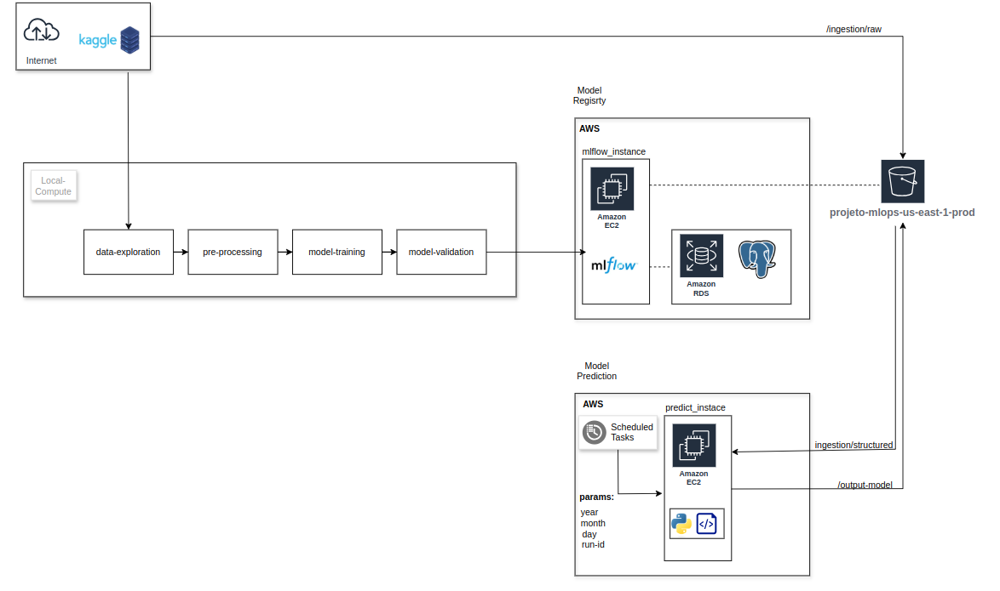

# Projeto MLOps - Arquitetura

## Visão Geral
Este projeto implementa uma arquitetura de MLOps para gerenciar o ciclo de vida de modelos de aprendizado de máquina, desde o desenvolvimento até a produção.

## Apresentação

## Diagrama da Arquitetura
Abaixo está um diagrama representando a arquitetura geral do projeto:

## Considerações
A ideia inicial era automatizar a esteira para realizar a criação dos recursos utilizados dentro da conta aws e assim tornar possível a reprodução da mesma estrutura na conta de quem fizesse o fork do projeto, sendo necessário apenas criar sua conta implementar algumas configurações requeridas, mas considerando o tempo e a complexidade de implementação de alguns serviços, mudei a abordagem e segui apenas com o case principal mas mantive a esteira criada em **.github**.

- Apenas para garantir a integridade da conta, as roles e credenciais listadas no projeto foram excluídas da conta.